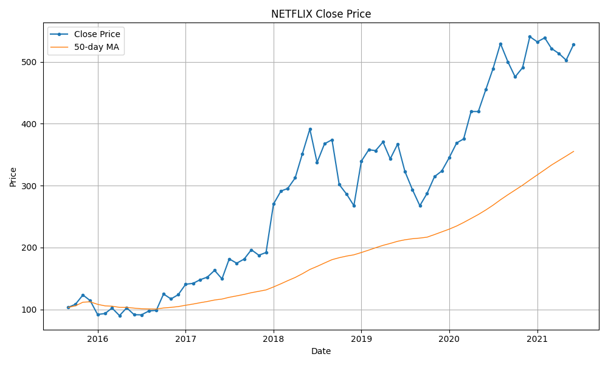

# Financial Data Scraper Pipeline

## Overview
This repository contains a reusable scraper pipeline for collecting financial stock data, cleaning it, storing it, analyzing it, and generating visualizations.

## Project Structure
```
financial-data-analysis-python/
├── README.md
├── requirements.txt
├── config.yaml
├── scraper.py
├── scraper/
│   ├── __init__.py
│   ├── manager.py
│   ├── parser.py
│   ├── cleaning.py
│   ├── storage.py
│   ├── analysis.py
│   ├── visualization.py
│   └── utils.py
├── data/
│   ├── raw/
│   ├── clean/
│   ├── output/
│   └── db/
├── tests/
│   └── test_manager.py
└── logs/
```

## What the pipeline does
- **Data Collection:** Scrapes stock data from a web page
- **Data Storage:** Writes raw and cleaned data to CSV files and optionally SQLite
- **Data Processing:** Converts dates and numeric values, removes bad rows, and sorts by date
- **Data Analysis:** Adds daily returns, moving averages, and volatility columns
- **Data Visualization:** Saves a price chart as a PNG file

## Tech Stack
- **Language:** Python 3.x
- **Data Manipulation:** Pandas
- **Web Scraping:** BeautifulSoup, Requests
- **HTML Parsing:** lxml, html5lib
- **Data Analysis:** Pandas (moving averages, volatility)
- **Visualization:** Matplotlib
- **Configuration:** PyYAML
- **Data Storage:** CSV, JSON, SQLite

## Usage
1. Install dependencies:
   ```bash
   pip install -r requirements.txt
   ```
2. Update `config.yaml` with the stock symbols and URLs you want to scrape.
3. Run the pipeline:
   ```bash
   python scraper.py --stock NETFLIX --output all
   ```
4. Use `--no-analysis` to skip analysis and charts:
   ```bash
   python scraper.py --stock NETFLIX --output csv --no-analysis
   ```

## Sample Output
Below is an example chart generated by the pipeline after scraping and analyzing stock data:



## Configuration
- `config.yaml` defines the stocks and output settings
- `requirements.txt` lists required Python packages
- `data/raw/`, `data/clean/`, and `data/output/` store the pipeline files

## Notes
- The scraper is modular and reusable for multiple stock URLs.
- `scraper.py` is the CLI entry point.
- `tests/` contains a simple unit test scaffold.
